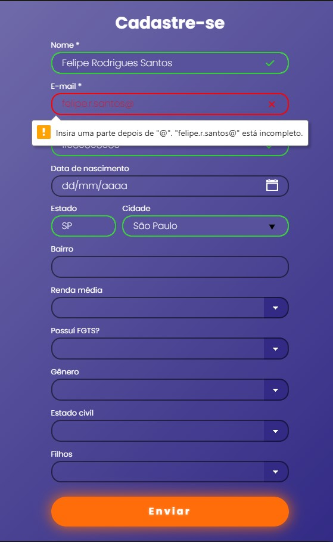
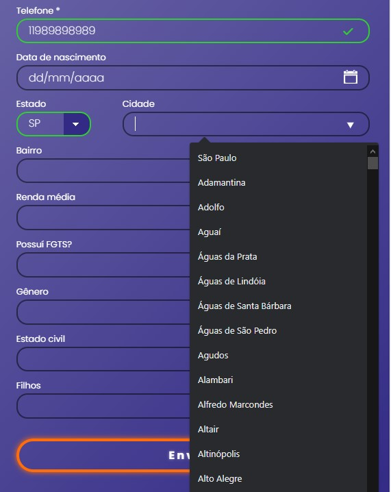

<h1 align="center"><b>LANDINGPAGE</b></h1>

 

Este projeto faz parte de um estudo prático da linguagem Csharp, com uso do Framework ASP.NET Core, Entity Core Framework e linguagens front-end como HTML, CSS e Javascript.
A página tem como função captar dados de possíveis clientes e armazena-los em um banco de dados para que possam ser administrados em campanhas de marketing.
 

<a href="#sobre"><b>Sobre</b></a> •
<a href="#features"><b>Features</b></a> •
<a href="#tecnologias"><b>Tecnologias</b></a> •
<a href="#pre-requisitos"><b>Pré-Requisitos</b></a> •
<a href="#autor"><b>Autor</b></a> 

 

<h2 id="sobre"><b>Sobre</b></h2>

O layout e a construção da páginas foram pensados de forma a ser uma página única que atraia a intenção do usuário a se cadastrar.

O banco de dados funciona através de migrations que é implementada por ferramentas do Entity Framework.

Para administrar como serão salvo os dados e como serão geridos a aplicação conta com classes de repositório, sendo que cada classe é especifica para manutenção de sua tabela.
 

Os objetos que dão os atributos necessários para o funcionamento da aplicação encontram-se na classe modelo, fazendo parte da MODEL no MVC. 

Em uma futura versão será adicionada uma DashBoard que vai gerir os dados de forma que o usuário possa identificar a melhor estratégia para vendas.
 

<h2 id="features"><b>Features</b></h2>

<h3><b>Carousel</b></h3>

Um Carousel que alterna as imagens automaticamente.

 

 
<h2><b>Formulário</b></h2>

O formulário possui diversas fatures para verificar se os dados estão corretos.

Com o uso de REGEX é possível validar ou não os dados inseridos em cada input

 
<h2><b>Menu Select</b></h2>

Para o carregamento das opções de cidades e estados foi utilizado um import de arquivo Json, assim as opções de cidades que aparecem são relativas a opção de estado selecionado.

Para facilitar a escolha da cidade foi utilizado a tag Datalist.

 
<h2><b>Confirmações</b></h2>

Ao clicar no botão "Enviar" os dados serão enviados como uma asp-action="CadastraCliente", os dados são baseados na @model da classe CLIENTE que gere todos os atributos solicitados no formulário.

O banco de dados aceita quase todas as informações como null exceto "Nome", "Telefone" e "E-mail", sendo que "Telefone" é a primary Key e "E-mail" um index único.

Internamente se as informações forem validadas as informações serão gravadas no banco de dados e será retornado uma string de confirmação, caso o contrário será informado o motivo que impossibilitou o cadastro.

 

<h2><b>Erros Esperados</b></h2>

Os erros esperados são os comuns em HTTP como o 500 e 404, ambos serão respondidos pela mesma view que será preenchida com a informação do erro.

 

<h2 id="tecnologias"><b>Tecnologias</b></h2>

- **`ASP.NET Core`**
- **`CSharp`**
- **`.NET Framework`**
- **`Entity Core Framework`**
- **`HTML 5`**
- **`CSS 3`**
- **`Javascript`**

A base tecnológica da aplicação é o ASP.NET Core, com o uso do MVC e pastas mapeadas para que a aplicação faça a integração entre Movel, View e Controller.

Para o uso do repositório foi utilizado o entity Framework, utilizando-se de migrations para que o banco de dados seja atualizado sem que dados sejam perdidos.

Com o objetivo de demonstrar o uso do ASP.NET poucas classes são criadas, apenas as necessárias para gerir as informações que serão armazenadas no banco de dados e o objeto que vai representar essas classes, sendo este a classe "cliente".

Para responsividade e demais interações visuais foram utilizados técnicas de animação com CSS e Javascript integrados ao HTML.
 

<h2 id="pre-requisitos"><b>Pré-Requisitos</b></h2>

A base funcional da aplicação fica no seguinte diretório "/bin/Release/net6.0/publish/", mas para que a aplicação rode corretamente e necessário possuir um banco de dados e configurá-lo através do arquivo <b>"appsettings.json"</b> e <b>appsettings.production.json</b>:

    "ConnectionStrings": {
      "DefaultConnection": "Server=(localdb)\\mssqllocaldb; Database=LandingPageDB; Trusted_Connection=True; MultipleActiveResultSets=true";
    }

Alterar a <b>DefaultConnection</b> para:

    "Data Source=SEU BANCO DE DADOS; Database=LandingPageDB; Trusted_Connection=True; MultipleActiveResultSets=true; User ID=SEU USER; Password=SUA SENHA"

Para executar a versão geral é necessário que a máquina possua o framework .NET 6 instalado.

Após a conexão estar configurada basta apenas inicializar a aplicação.

 

<h2 id="autor"><b>Autor</b></h2>

| [ Felipe Rodrigues Santos](https://github.com/FelipeR-S) |  
| :---: |